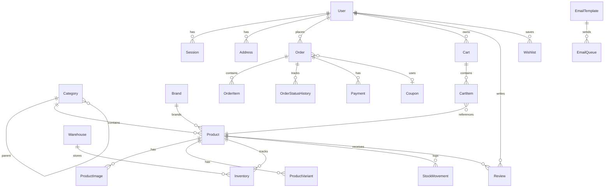
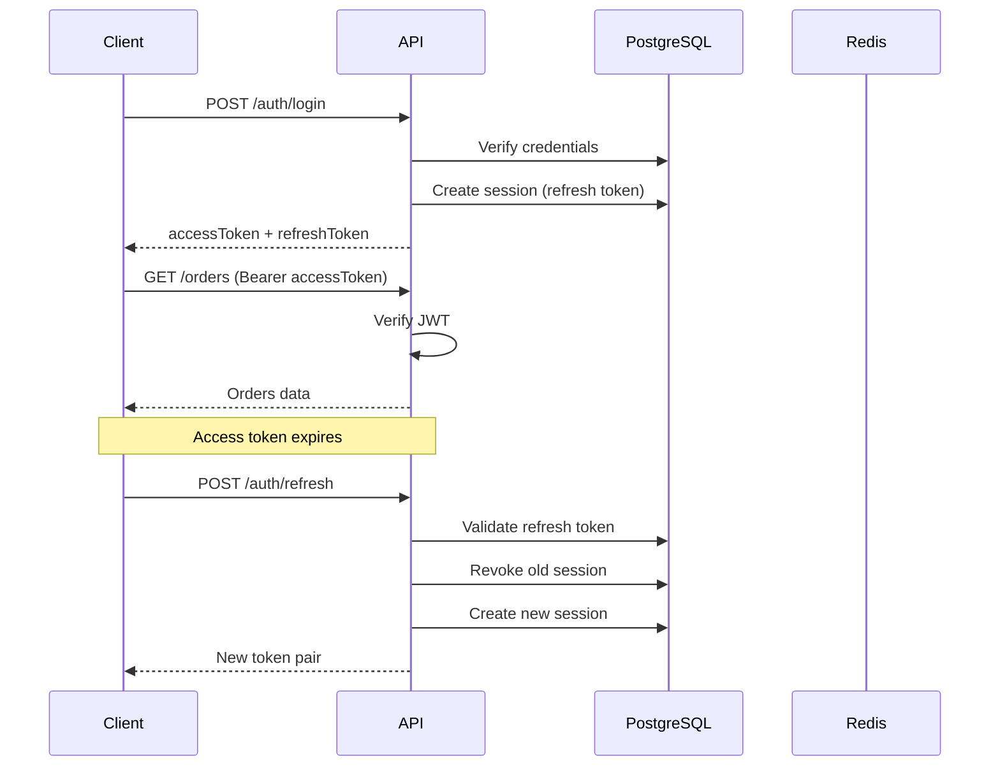

# Marea E-Commerce API — Architecture

Production-ready Node.js backend for customer website, admin dashboard, mobile apps, and third-party integrations.

## Stack

| Layer | Technology |
|-------|------------|
| Runtime | Node.js 20+ |
| Framework | Express.js |
| Database | PostgreSQL (Supabase) |
| ORM | Prisma |
| Auth | JWT + Refresh Token Rotation |
| Cache | Redis (ioredis) |
| Real-time | Socket.IO |
| Jobs | BullMQ |
| Docs | Swagger / OpenAPI 3 |
| Validation | Zod |
| Logging | Winston |
| Container | Docker |

## Folder Structure (Clean Architecture)

```
api/
├── prisma/
│   ├── schema.prisma          # Database models
│   └── seed.js                # Seed data
├── src/
│   ├── config/                # env, prisma, redis, swagger
│   ├── modules/               # Feature modules
│   │   ├── auth/              # routes → controller → service → repository
│   │   ├── products/
│   │   ├── categories/
│   │   ├── cart/
│   │   ├── orders/
│   │   ├── admin/
│   │   └── public/
│   ├── shared/
│   │   ├── errors/
│   │   ├── middleware/
│   │   ├── services/
│   │   └── utils/
│   ├── jobs/                  # BullMQ workers & queues
│   ├── sockets/               # Socket.IO
│   ├── routes/                # Route aggregator
│   ├── app.js
│   └── server.js
├── docker-compose.yml
├── Dockerfile
└── ARCHITECTURE.md
```

## ER Diagram



## API Versioning

Base URL: `/api/v1`

| Version | Status |
|---------|--------|
| v1 | Current |

Future versions: `/api/v2` alongside v1 during migration period.

## REST Endpoints

### Auth `/api/v1/auth`

| Method | Endpoint | Auth | Description |
|--------|----------|------|-------------|
| POST | `/register` | Public | Customer/admin registration |
| POST | `/login` | Public | Login |
| POST | `/refresh` | Public | Refresh token rotation |
| POST | `/logout` | Public | Revoke session |
| POST | `/forgot-password` | Public | Send reset email |
| POST | `/reset-password` | Public | Reset password |
| GET | `/verify-email/:token` | Public | Verify email |
| GET | `/me` | JWT | Get profile |
| PATCH | `/me` | JWT | Update profile |
| POST | `/change-password` | JWT | Change password |
| DELETE | `/me` | JWT | Delete account |

### Products `/api/v1/products`

| Method | Endpoint | Auth | Description |
|--------|----------|------|-------------|
| GET | `/` | Public | List with filters, pagination |
| GET | `/:id` | Public | Get by ID |
| GET | `/slug/:slug` | Public | Get by slug |
| POST | `/` | Admin | Create product |
| PATCH | `/:id` | Admin | Update product |
| DELETE | `/:id` | Admin | Soft delete |
| POST | `/:id/restore` | Admin | Restore product |

### Categories `/api/v1/categories`

| Method | Endpoint | Auth | Description |
|--------|----------|------|-------------|
| GET | `/` | Public | Flat list |
| GET | `/tree` | Public | Nested tree |
| GET | `/:id` | Public | Get by ID |
| POST | `/` | Admin | Create |
| PATCH | `/:id` | Admin | Update |
| DELETE | `/:id` | Admin | Soft delete |

### Cart `/api/v1/cart`

| Method | Endpoint | Auth | Description |
|--------|----------|------|-------------|
| GET | `/` | Optional | Get cart (guest via `x-session-id`) |
| POST | `/items` | Optional | Add item |
| PATCH | `/items/:itemId` | Optional | Update quantity |
| DELETE | `/items/:itemId` | Optional | Remove item |

### Orders `/api/v1/orders`

| Method | Endpoint | Auth | Description |
|--------|----------|------|-------------|
| POST | `/` | Optional | Place order (COD supported) |
| GET | `/` | JWT | List orders |
| GET | `/:id` | JWT | Order details |
| PATCH | `/:id/status` | Admin | Update status |

### Admin `/api/v1/admin`

| Method | Endpoint | Auth | Description |
|--------|----------|------|-------------|
| GET | `/dashboard` | Admin | Dashboard statistics |
| GET | `/audit-logs` | Admin | Audit trail |
| GET | `/admin-logs` | Admin | Admin activity logs |

### Public `/api/v1/public`

| Method | Endpoint | Auth | Description |
|--------|----------|------|-------------|
| GET | `/recent-orders` | Public | Live sales popup data |
| GET | `/live-sale-settings` | Public | Popup configuration |

## Authentication Flow



## Roles & Permissions

| Role | Access |
|------|--------|
| SUPER_ADMIN | Full system access |
| ADMIN | Products, orders, users, reports |
| MANAGER | Orders, inventory, reports |
| WAREHOUSE_MANAGER | Inventory, stock, shipping |
| CUSTOMER | Own profile, cart, orders, reviews |

## Redis Caching Strategy

| Key Pattern | TTL | Purpose |
|-------------|-----|---------|
| `products:list:*` | 5 min | Product listings |
| `categories:tree` | 10 min | Category tree |
| `product:{id}` | 5 min | Single product |

Invalidate on create/update/delete via `cacheDel('products:*')`.

## Socket.IO Events

| Event | Room | Direction | Purpose |
|-------|------|-----------|---------|
| `join` | admin / customer | Client → Server | Join notification room |
| `new_order` | admin | Server → Admin | New order alert |
| `order_status` | user:{id} | Server → Customer | Status update |
| `live_sale` | all | Server → All | Sales popup |

## BullMQ Jobs

| Queue | Jobs |
|-------|------|
| `email` | Verification, password reset, order confirmation |
| `notifications` | Push notifications |
| `reports` | CSV/Excel/PDF export |

Run worker: `npm run worker`

## Email Architecture

1. API enqueues email to BullMQ
2. Worker processes queue
3. Nodemailer sends via SMTP
4. Status logged in `email_queue` table

## Getting Started

```bash
cd api
npm install
cp .env.example .env   # or use root .env
npm run db:generate
npm run db:push          # sync schema to Supabase
npm run db:seed
npm run dev
```

- API: http://localhost:3000/api/v1/health
- Swagger: http://localhost:3000/api/v1/docs

Default admin: `admin@marea.com` / `Admin@123`

## Docker Deployment

```bash
docker compose up -d
```

## Production Checklist

- [ ] Set strong `JWT_SECRET` and `JWT_REFRESH_SECRET`
- [ ] Enable `REDIS_URL` for cache and jobs
- [ ] Configure SMTP for emails
- [ ] Set `CORS_ORIGIN` to production domains
- [ ] Run `prisma migrate deploy` in CI/CD
- [ ] Enable HTTPS reverse proxy (Nginx / Railway)
- [ ] Set up monitoring (Sentry, Datadog)
- [ ] Configure automated backups for PostgreSQL

## Testing Strategy

| Layer | Tool | Focus |
|-------|------|-------|
| Unit | Jest | Services, utilities |
| Integration | Supertest | API endpoints |
| E2E | Playwright | Full checkout flow |

## CI/CD Recommendations

```yaml
# GitHub Actions pipeline
- lint
- prisma validate
- unit tests
- integration tests
- docker build
- deploy to staging
- smoke tests
- deploy to production
```

## Roadmap (Modules to Extend)

- [ ] Reviews CRUD + moderation
- [ ] Q&A module
- [ ] Stripe / PayPal / MyFatoorah webhooks
- [ ] Full-text search (PostgreSQL tsvector or Elasticsearch)
- [ ] PDF invoice generation
- [ ] Report exports (CSV, Excel, PDF)
- [ ] 2FA (TOTP)
- [ ] File upload to Supabase Storage
- [ ] Abandoned cart emails
- [ ] Loyalty & referral system
